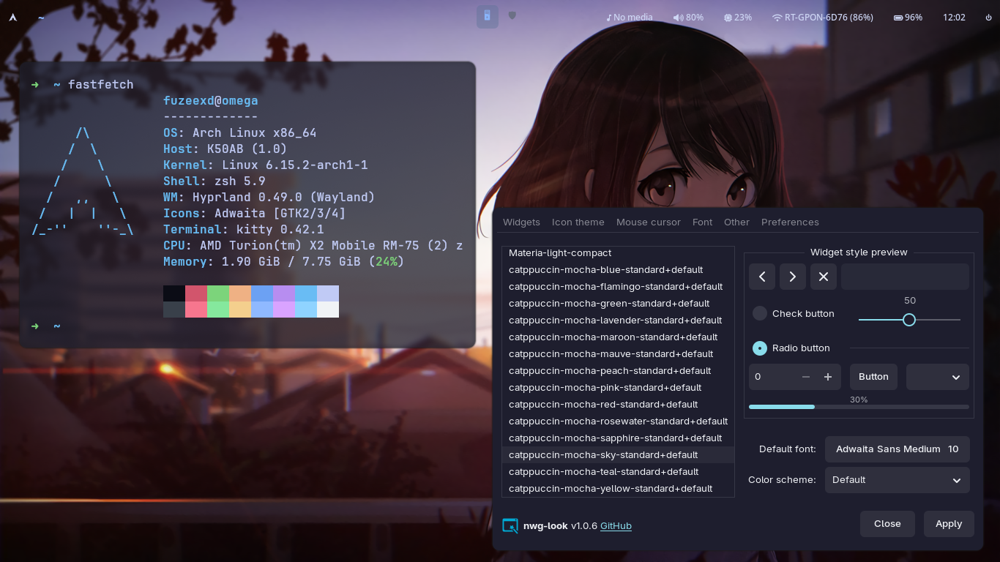

# TheFuZeeXD Hyprland Config

Конфигурация Hyprland для Arch Linux с минималистичным и аккуратным стилем. Репозиторий содержит готовые настройки для Hyprland, Waybar, Kitty, Hyprlock и Wlogout, а также автоматический скрипт установки который я нафарганил.

---

## 📸 Скриншоты

> Скриншоты взяты прямо из этого репозитория:

| Screenshot | Screenshot 1 |
| --- | --- |
|  |  |

---

## ✨ Что входит в конфиг
✅ Полная настройка Hyprland (tiling WM)  
✅ Красивый GTK и шрифты  
✅ Waybar с чистой темой  
✅ Kitty с кастомным оформлением  
✅ Hyprlock с готовым конфигом и оформлением  
✅ Wlogout с иконками  
✅ Скрипт автоматической установки `install.sh`  
✅ Готовые примерные обои (под себя)  

---

## ⚡️ Быстрая установка

> Перед установкой рекомендую заранее скачать пакет `git` чтобы быстро установить репозиторий

> Список пакетов: hyprland hyprutils hyprgraphics hyprland-qtutils hyprlang xdg-desktop-portal-hyprland grim aquamarine hyprpaper yay btop hyprlock kitty nwg-look fastfetch waybar wofi playerctl ttf-font-awesome git base-devel wlogout catppuccin-gtk-theme-mocha

### 1️⃣ Скачать репозиторий

В терминале с помощью git:

```bash
git clone https://github.com/TheFuZeeXD/arch-hyprland-config.git
```

Или скачать zip через кнопку **[Code > Download ZIP](https://github.com/TheFuZeeXD/arch-hyprland-config/archive/refs/heads/main.zip)** на GitHub и распаковать.

---

### 2️⃣ Настройка конфигов

> Важно! Конфигурацию монитора не указывается автоматически. Вам придется его указать самим в hyprland.conf и hyprpaper.conf, а также в wallpaperExchange.sh

> Рекомендую заранее перед установкой настроить hyprland.conf под себя и заменить обои на свои. Не волнуйтесь если уже все установили, вы также после установки можете все настроить

Откройте файл:

```
hypr/hyprland.conf
hypr/hyprpaper.conf
hypr/sh/wallpaperExchange.sh
```

Найдите строку:

```
monitor=
```

и впишите корректное имя вашего монитора.  
Узнать его можно несколькими способами:

Если у вас установлен пакет hyprland
```bash
hyprctl monitors
```
Либо если hyprland нет, тогда воспользуйтесь xrandr
```bash
xrandr --prop | grep -A2 " connected"
```
---

### 3️⃣ Запустить скрипт установки

С помощью вашего терминала перейдите в директорию конфига и выдайте ему права:

```bash
cd arch-hyprland-config
chmod +x install.sh
```

Запустите скрипт:
```
./install.sh
```

Скрипт установит все нужные зависимости и пакеты, а также скопирует все нужные конфиги в `~/.config`.

---

## 🎨 Настройка обоев

- Чтобы сменить обои на свои зайдите в директорию ~/.config/hypr/HyprWallpaper/
- Для смены обоев на случайные есть bash скрипт ~/.config/hypr/sh/wallpaperExchange.sh
- В **hyprland.conf** уже есть готовый бинд на смену обоев с помощью `wallpaperExchange.sh`:

```
bind = $mainMod, F8, exec, $exchangewallpaper
```

> Если вы хотите сменить путь к обоям то перейдите в файл `hyprpaper.conf`.

---

## 🔒 Настройка Hyprlock

Hyprlock это экран блокировки который после ввода пароля разблокирует доступ к рабочему столу:

- Чтобы сменить обои на свои зайдите в директорию ~/.config/hypr/Hyprlock/.
- Если вы хотите настроить hyprlock под себя то откройте файл `hyprlock.conf` в директории `~/.config/hypr/`

Чтобы запустить hyprlock вы можете нажать конбинацию клавишь **Windows + L**, 
но также если вам нужно запустить hyprlock через терминал, вы можете воспользоваться вот этой командой: 

```bash
hyprlock
```
- Hyprlock по умолчанию запускается вместе с hyprland, если он вас задолбал как и меня, то откройте файл `hyprland.conf`
```Найдите строку
exec-once = 
```
и удалите из нее hyprlock.

---

## 🖥️ Настройка Kitty

Kitty — это современный, быстрый и функциональный GPU-ускоренный терминал:

- Для настройки Цвета или шрифтов вам нужно открыть файл `kitty.conf` в директории `~/.config/kitty/`
- В hyprland.conf уже есть готовый бинд для запуска kitty

Открыть Kitty:

```
Windows + Q
```

В конфиге Kitty можно редактировать:

- Цветовую схему
- Шрифт и его размер
- Прозрачность:

```
background_opacity 0.9
font_size 12.0
```

---

## 📊 Настройка Waybar

Waybar — это современная панель статуса для Wayland 

- В Waybar можно настроить много всяких функций, чтобы было красиво и удобно для использования
- Если вы хотите настроить Waybar то перейдите в директорию `~/.config/waybar`
- style.css отвечает за оформление Waybar, а config за настройку
- media.sh скрипт который настроен для waybar с помощью пакета playerctl. Данный скрипт отображает включенные треки, песни и т.д
- Если вы хотите добавить или удалить элемент в waybar откройте файл `config` в директории `~/.config/waybar`

Пример всех функции waybar
```
cpu             Загрузка процессора (общая или по ядрам).       "format": "CPU: {usage}%"
memory          Использование ОЗУ и swap.       "format": "RAM: {used}GiB"
temperature     Температура CPU/GPU (через sensors).    "format": "{temperatureC}°C"
disk            Свободное место на диске.       "path": "/"
battery         Уровень заряда, статус зарядки, время до разряда.       "format": "{capacity}% {icon}"
backlight       Яркость экрана (поддержка acpilight и brightnessctl).   "format": "{percent}%"
network         Статус Wi-Fi/Ethernet, скорость, SSID, уровень сигнала.
bluetooth       Статус Bluetooth (требует bluetoothctl).
pulseaudio      Громкость, иконка, возможность клика для mute.
wireplumber     Альтернатива pulseaudio (для PipeWire).
clock           Текущее время с кастомным форматом (strftime).
idle_inhibitor  Показывает статус "ингибитора бездействия" (полезно для презентаций).
sway/workspaces Активные рабочие пространства (для Sway).
sway/mode       Текущий режим Sway (например, resize).
wlr/taskbar     Панель задач для Wayland (экспериментально).
tray            Иконки в системном трее (Telegram, Discord и др.).
custom/text     Статичный текст.
custom/script   Запуск bash/python-скриптов для кастомного вывода.
custom/weather  Погода (через wttr.in или API).
```
Включить waybar через терминал:

```
waybar
```
- waybar запускается вместе с hyprland поэтому вам не придется его запускать вручную

---

## ⏻ Настройка Wlogout

Wlogout - это GUI управление питанием. С помощью wlogout можно в пару кликов выключить устройтсво или перезагрузить.

- Если вам не нравятся иконки в wlogout вы можете их сменить в директории `~/.config/wlogout/icon/`
- style.css отвечает за оформление, а layout настройку

Пример всех функций в wlogout
```
shutdown	  Выключить компьютер	systemctl poweroff
reboot	    Перезагрузить компьютер	systemctl reboot
suspend	    Перевести в спящий режим	systemctl suspend
hibernate	  Гибернация (если настроена)	systemctl hibernate
logout	    Выйти из сеанса (завершить WM)	swaymsg exit / hyprctl dispatch exit
lock	      Заблокировать экран	swaylock / hyprlock
switchuser	Сменить пользователя (редко поддерживается)	loginctl switch-user
cancel	    Кнопка "Отмена" (закрыть меню)	

```
- Wlogout не имеет бинда но по желанию вы можете настроить в hyprland.conf
- Чтобы вызвать wlogout вы можете воспользоваться waybar с помощью право-верхней кнопки в углу либо через терминал

Через терминал:
```
wlogout
```

---

## ⚠️ Возможные ошибки

- **monitor= не указан или неверный**  
  → Hyprland не запустится на нужный экран. Проверьте название через `hyprctl monitors`.

- **Waybar не найден**  
  → Установите:

```bash
sudo pacman -S waybar
```

- **Hyprlock отсутствует**  
  → Установите через AUR:

```bash
yay -S hyprlock
```

- **Недостаточно прав на install.sh**  
  → Добавьте права:

```bash
chmod +x install.sh
```

---

## 📜 Лицензия

Этот репозиторий распространяется под лицензией MIT. Используйте, модифицируйте и распространяйте свободно.
**[TheFuZeeXD](https://github.com/TheFuZeeXD)**
---
